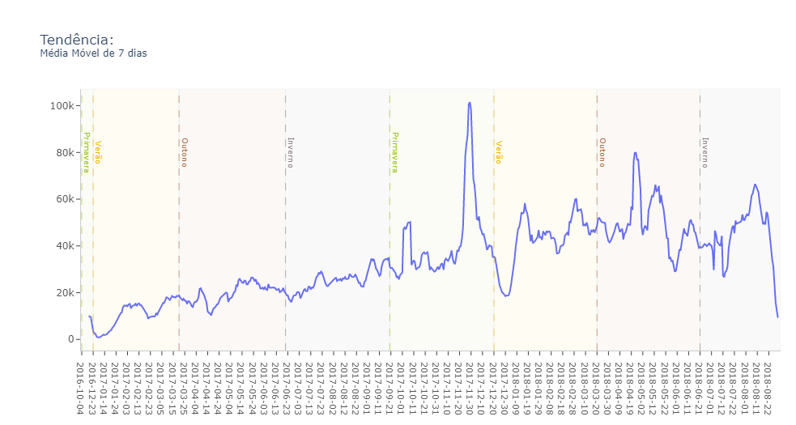
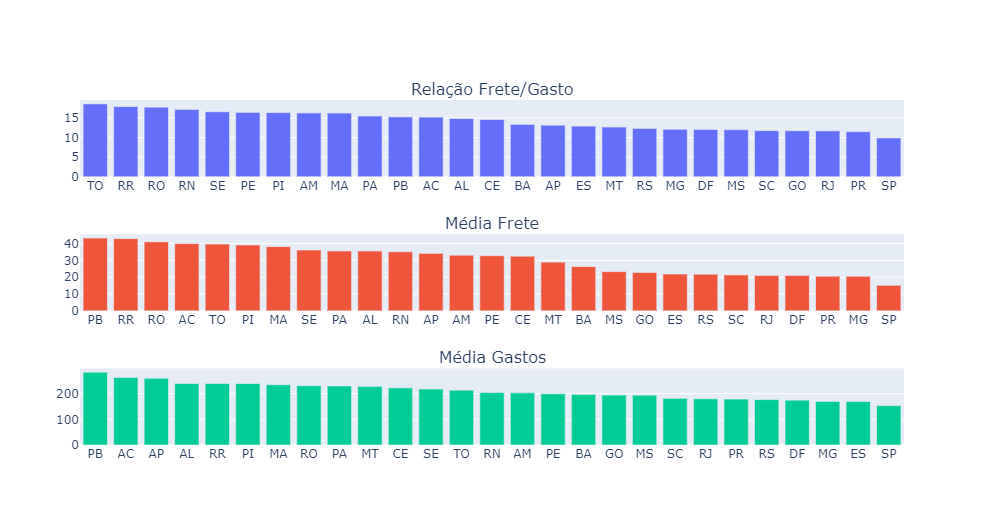
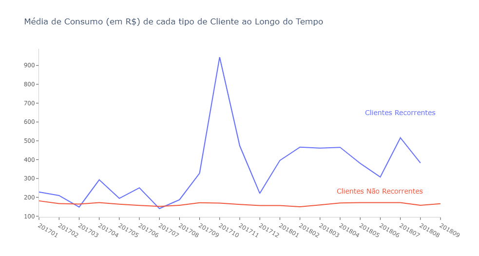
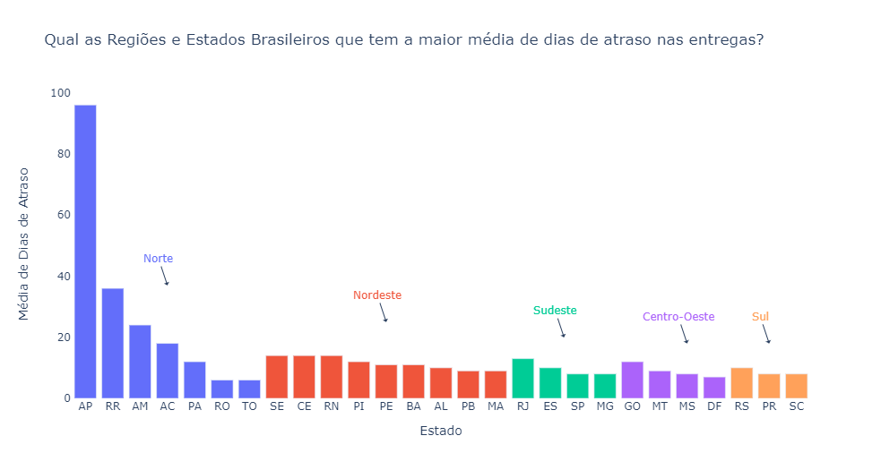
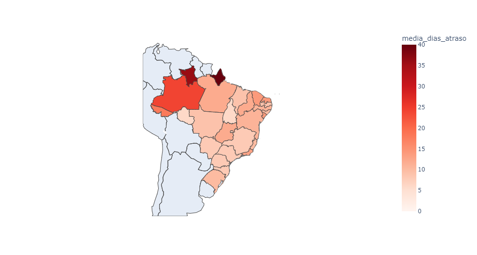
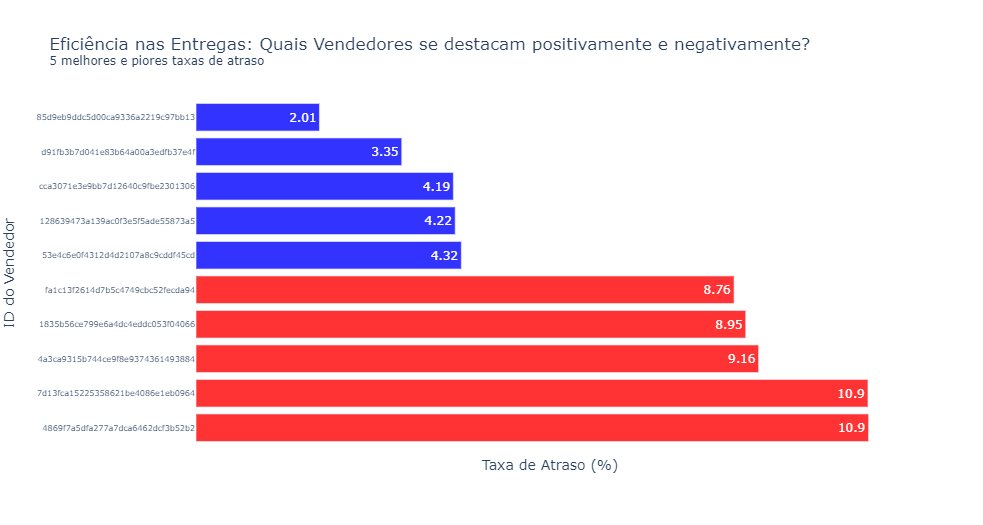
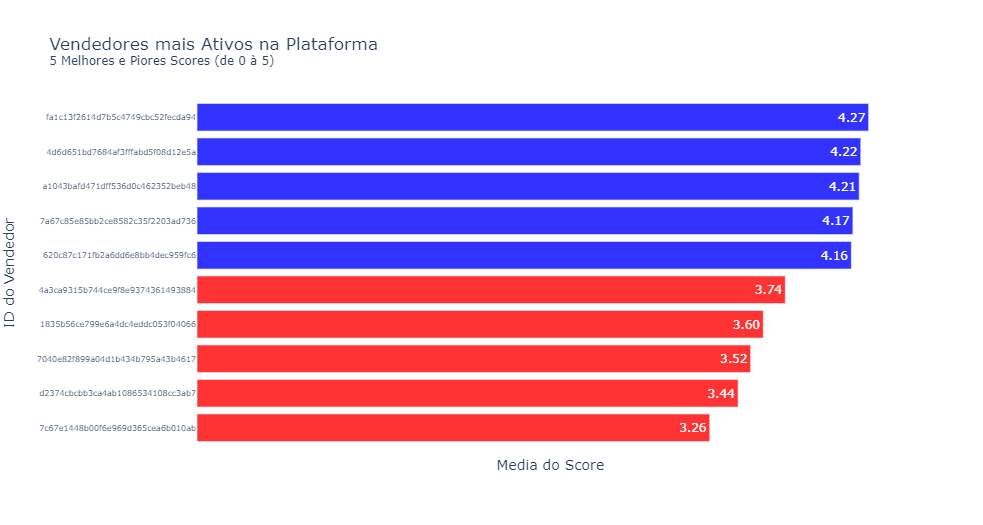

# Analisando Dados e Respondendo Perguntas de Negócio

## Contexto
O Olist é uma empresa Brasileira focada em e-commerce, que concentra vendedores que desejam anunciar em markeplaces como Mercado Livre, Amazon e B2W.
Do outro lado, concentra os produtos de todos os vendedores em uma loja que fica visível ao consumidor final. Marketplace é basicamente o comércio tradicional de forma virtual (E-Commerce), onde os lojistas conseguem vender na internet de forma simples e com alta escalabilidade. O Olist promete alavancar as vendas online de lojistas, fornecendo ferramentas para otimização de toda cadeia de vendas, como logística, precificação, visibilidade, gestão integrada, entre outros.

## Dados
Os dados utilizados são públicos e disponibilizados pela empresa brasileira de soluções de ecommerce [Olist](https://olist.com/pt-br/).
O dataset contém informações de cerca de 100k registros de vendas de diversos marketplaces no Brasil entre 2016 e 2018.
Como se tratam de dados reais, foram ocultados informações confidenciais como nomes.

Os dados estão organizados em um modelo multidimensional sendo o *olist_orders_dataset.csv* a tabela fato do modelo.

São muitas colunas, portanto vou descrever somente as que eu utilizei:

- **customer_id**: Identificador único do Cliente
- **seller_id**: Identificador único do Vendedor
- **order_approved_at**: Data de Aprovação da Compra
- **order_delivered_customer_date**: Data de entrega ao Cliente
- **order_estimated_delivery_date**: Data estimada de entrega ao Cliente
-	**payment_value**: Valor total pago (produto+frete)
-	**freight_value**: Valor do Frete
-	**review_score**: Avaliação fornecida pelo Cliente ao Vendedor
-	**customer_state**: Estado do Cliente
-	**seller_state**: Estado do Vendedor

[Link para os datasets no Kaggle](https://www.kaggle.com/olistbr/brazilian-ecommerce)

## Definição do Problema
Visando um ambiente real de negócios, o objetivo é resolver algumas questões levantadas por gestores,
com a finalidade de fornecer um relatório com todas as respostas detalhadas em forma de gráfico e tabela. 

Foram levantadas as seguintes questões:
1) Qual a tendência das vendas? Há uma tendência de crescimento?
1) Quais estados com frete mais caro em relação ao valor total da compra?
2) Há diferença na média de consumo dos clientes recorrentes (aqueles que efetuaram **5 ou mais** compras no período) e dos não recorrentes (aqueles que efetuaram **menos que 5** compras no período)?
3) Qual a média de **dias de atraso** nas entregas por localidade?
4) Qual as 5 maiores e menores taxas de atraso entre os vendedores com **500 ou mais vendas** na base de dados?
5) Qual a média de score (avaliação) de cada vendedor que atende ao critério de: pelo menos 10 vendas em **todos** os 12 últimos meses da base de dados?

## Ferramentas Utilizadas
Foi realizada toda a exploração e análise dos dados utilizando **SQL**. Para geração das visualizações foi usada a biblioteca **Plotly** da linguagem Python.

Foram utilizados diversos comandos para as análises em SQL, como cláusulas básicas de consulta como _SELECT, GROUP BY, ORDER BY, WHERE_. De agregação como _SUM, COUNT, AVG, STDDEV_. E outras funções como _CASE, WINDOW, SUBQUERY, TEMP TABLE, CTE_, entre outras. 

[Script SQL](scripts/analiseSQL)

Já em python foi usada principalmente a bibilioteca _plotly_. Além disso, o pacote _psycopg2_ auxiliou na conexão ao PostgreSQL.

[Script Python](scripts/analise_jupyter.ipynb).

## Análise Exploratória dos Dados

### Visão Geral dos dados
|            customer_id           |             seller_id            |  order_approved_at  | order_delivered_customer_date | order_estimated_delivery_date | payment_value | freight_value | review_score | product_category_name | customer_state | seller_state |
|:----------------------------------:|:----------------------------------:|:---------------------:|:-------------------------------:|:-------------------------------:|-----------------|-----------------|----------------|-------------------------|------------------|----------------|
| f6dd3ec061db4e3987629fe6b26e5cce | dd7ddc04e1b6c2c614352b383efe2d36 | 2017-04-26 11:05:13 |           2017-05-12          |           2017-05-15          | 259,83          | 19,93           | 4,00           | pet_shop              | SP             | SP           |
| 6489ae5e4333f3693df5ad4372dab6d3 | 5b51032eddd242adc84c38acab88f23d | 2018-01-14 14:48:30 |           2018-01-22          |           2018-02-05          | 216,87          | 17,87           | 5,00           | moveis_decoracao      | MG             | MG           |
| 816cbea969fe5b689b39cfc97a506742 | 6426d21aca402a131fc0a5d0960a3c90 | 2017-05-17 03:55:27 |           2017-05-22          |           2017-06-06          | 34,59           | 12,69           | 4,00           | utilidades_domesticas | MG             | SP           |

Como já foi mencionado, alguns dados foram ocultados, portanto não está disponível o nome do cliente e do vendedor, somente o ID.

### Resumo estatístico do gasto dos consumidores _(payment_value)_
|   Contagem  | Média | Perc.25 | Perc.50  (Mediana) | Perc.75 | Perc.90 | Desvio Padrão | Valor Máximo     | Valor Minimo  |
|:----------:|:-------:|:---------:|:---------:|:---------:|-----------|-----------------|-----------|-------|
| 117.329 |  172,06 |   60,75   |   108,10  |   189,06  | 337,04    | 265,39          | 13.664,08 | 0,00  | 

90% dos consumidores gastam até R$337,04 por compra no e-commerce.

### Data do primeiro e último registro do dataset
| Data inicial | Data Final             
|:----------------:|:-------------:|
| 2016-10-04 09:43:32 | 2018-09-03 17:40:06 |

### Top 10 Estados com maior gasto total
| Estado do Consumidor | Total Gasto | Porcentagem do Total               
|:----------------:|:-------------:|:------------------:|
| SP             | 7.599.878  | 37.65              |
| RJ             | 2.741.288  | 13.58              | 
| MG             | 2.313.560  | 11.46              |
| RS             | 1.151.948  | 5.71               | 
| PR             | 1.066.627 | 5.28               | 
| BA             | 791.726  | 3.92               |
| SC             | 778.621    | 3.86               |
| GO             | 469.961    | 2.33               | 
| DF             | 433.600    | 2.15               | 
| ES             | 392.819    | 1.95               |

Conforme o esperado, o Estado de São Paulo aparece como o mais representativo sobre as vendas, e apenas 2 Estados + Distrito Federal de fora do Sul/Sudeste aparecem no Top 10. Isso pode ser considerado um bom sinal em relação a veracidade dos dados, pois não seguem nenhum padrão anormal.

## Relatório

### 1) Qual a tendência das vendas? Há uma tendência de crescimento?

O gráfico mostra uma tendência de crescimento na média móvel de 7 dias.
As estações do ano aparecem para identificar se há algum tipo de sazonalidade.

Chama atenção o pico por volta do final de novembro de 2017. Nesse período acontece a _Black Friday_.

### 2) Quais estados com frete mais caro em relação ao valor total da compra?
| Ranking | Estado do Consumidor| Media do Frete | Media dos Gastos | Relação Frete/Gastos (%) |
|:------:|------------------|---------------|--------------------|---------------------------|
| 1      | TO             | 39,74         | 213,59             | 18,61                     |
| 2      | RR             | 42,98         | 239,66             | 17,93                     |
| 3      | RO             | 41,04         | 231,01             | 17,77                     |
| 4      | RN             | 35,14         | 204,26             | 17,20                     |
| 5      | SE             | 36,18         | 218,08             | 16,59                     |
|  ...   |       |        |            |                      |
| 23     | SC             | 21,40         | 181,79             | 11,77                     |
| 24     | GO             | 22,83         | 194,52             | 11,74                     |
| 25     | RJ             | 21,09         | 180,11             | 11,71                     |
| 26     | PR             | 20,61         | 178,99             | 11,51                     |
| 27     | SP             | 15,20         | 153,45             | 9,91                      |

Os Estados do Norte e Nordeste tem o frete em média mais caro.

Isso pode ser por conta de estarem localizados mais distantes dos grandes centros de distribuição, mas também pode ser pelo fato de terem um gasto em média maior -como pode ser observado na tabela e no gráfico acima- consequentemente o frete aumentaria proporcionalmente. Pela relação frete/gastos, pode se confirmar que a localização é um fator determinante no valor do frete, como já era de se esperar.

### 3) Há diferença na média de consumo dos clientes recorrentes (aqueles que efetuaram 5 ou mais compras no período) e dos não recorrentes (aqueles que efetuaram menos que 5 compras no período)?
|     Clientes    | Quantidade  de Clientes | Média de Gasto  por Compra |
|:---------------:|------------------------|---------------------------|
| Recorrentes     | 704                    | 393,43                    |
| Não Recorrentes | 97.212                 | 156,02                    |

Inicialmente, há uma diferença significativa no consumo dos dois tipos de clientes. Porém a quantidade de dados dos clientes recorrentes (na coluna "Quantidade de Clientes") é bem baixa. Por isso a volatilidade ao longo do tempo mostrado no gráfico é muito maior que dos clientes não recorrentes. Precisaria de mais dados para de fato tirar alguma conclusão.

### 4) Qual a média de dias de atraso nas entregas por localidade?
| Ranking | Estado do  Consumidor | Média de Dias   de Atraso | Entregas Concluídas   com Atraso
|:---:|---|---|---|
| 1 | AP | 96 | 3 |
| 2 | RR | 36 | 5 |
| 3 | AM | 24 | 5 | 
| 4 | AC | 18 | 3 |
| 5 | SE | 14 | 59 |

Para responder essa questão, eu filtrei o dataset apenas quando houve atraso nas entregas.
Alguns estados da região Norte se destacam com mais dias de atraso, mas assim como na questão anterior, os dados de entregas concluídas com atraso são pequenos demais para se tirar alguma conclusão.

### 5) Qual as 5 maiores e menores taxas de atraso entre os vendedores com 500 ou mais vendas na base de dados?

Para essa questão, a "taxa de atraso" foi definida pelo cálculo: (Entregas com atraso / Total de Entregas) por cada vendedor, formatada em porcentagem.
Ou seja, no caso de uma taxa de 5%, a cada 100 entregas, 5 são recebidas com atraso pelo consumidor.  

### 6) Qual a média de score (avaliação) de cada vendedor que atende ao critério de pelo menos 10 vendas em TODOS os 12 últimos meses da base de dados?

24 vendedores atendem ao critério proposto nessa questão. Optei por mostrar no gráfico os que se destacavam positivamente e negativamente.
Lembrando que o Score é uma avaliação da experiência de compra pelo cliente, podendo ir de 0 à 5.
